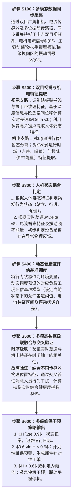

```mermaid
graph TD
    s100["<b>步骤 S100：多模态数据同步采集</b><br/>通过双目广角相机、电流传感器及多位振动传感器，同步采集扶梯正上方双目视频流、电机电流信号$I(t)$、主驱动链轮/扶手带摩擦轮/梯级换向区的振动信号$V(t)$。"]
    s200["<b>步骤 S200：双目视觉与机电特征提取</b><br/><b>视觉支路：</b>识别踏板警戒线与扶手带纹理特征，基于深度信息与欧氏空间位移计算实时差速$\\Delta v$；利用多骨骼关键点提取人体姿态特征。<br/><b>机电支路：</b>对$I(t)$进行稳/暂态分离；对$V(t)$进行时域（方差、峰值）与频域（FFT能量）特征提取。"]
    s300["<b>步骤 S300：人机状态耦合判定</b><br/>1. 根据人体姿态特征判定乘梯行为状态（站立、行进、倾倒）。<br/>2. 根据实时差速$\\Delta v$、电流暂态特征及振动频率能量，初步判定设备是否存在异常物理反馈。"]
    s400["<b>步骤 S400：动态健康度评估基准调度</b><br/>将行为状态作为环境变量，动态调度预设的对应负载工况评估基准模型（设定当前状态下的允许差速阈值、电流特征区间及振动频谱容差）。"]
    s500["<b>步骤 S500：多模态数据级联融合与交叉验证</b><br/><b>时序级联：</b>验证实时差速与机电特征在时间轴上的相关性。<br/><b>故障验证：</b>结合不同传感器物理位置特征，通过交叉验证消除人员行为干扰，计算扶梯实时综合健康度指数$H$。"]
    s600["<b>步骤 S600：多级维保干预策略输出</b><br/>1. $H \\ge 0.9$：状态正常，记录运行日志。<br/>2. $0.6 \\le H &lt; 0.9$：计划性维保预警，生成部件针对性工单。<br/>3. $H &lt; 0.6$ 或判定为倾倒：紧急停机干预，联动平缓停机。"]
    s100 --> s200
    s200 --> s300
    s300 --> s400
    s400 --> s500
    s500 --> s600

```